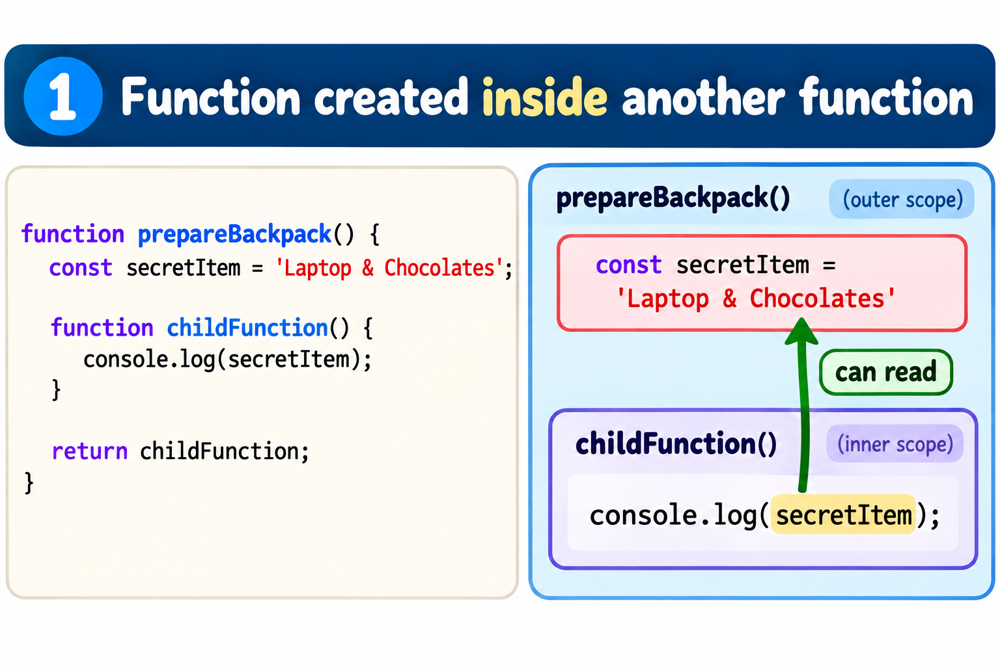
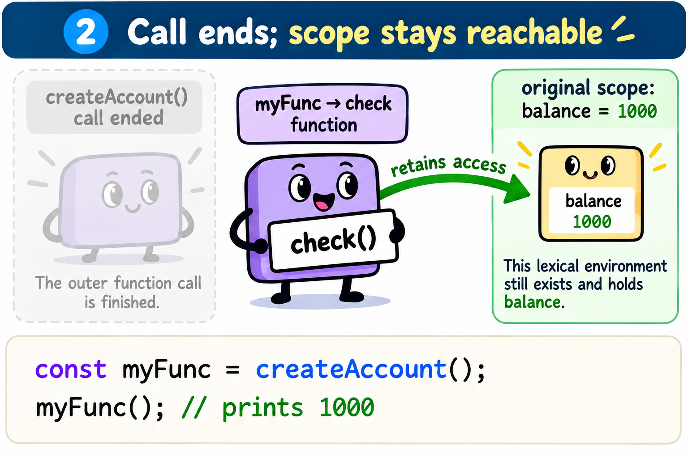

### Closure

- it is a function that refuses to forget.

Ex:

```
Imagine a parent function packs a school backpack for their child,hands it to them and then parent leaves the house.
```

#### Implementation

```
function prepareBackpack() {
    const secretItem = "Laptop & Chocolates";
    // Parent's variable

function childFunction() {

        // The child uses the parent's variable

console.log(`I am using my parent's: ${secretItem}`);
}

return childFunction;

 The parent returns the child function and "dies"
}

 1. We run the outer function.

It returns the child function to us.

const startSchoolDay = prepareBackpack();

2. The 'prepareBackpack' function has completely finished executing.

 Standard rules say 'secretItem' should be erased from RAM forever.

 3. We run the child function later in the day:

startSchoolDay();

```




#### Memory life cycle of a closure

```
function createAccount(){
    let balance = 1000;
    return function check(){
       console.log(balance);
    }
}
const myFunc =createAccount();
```


#### 1. Global Stage

- when script starts ,Global execution context is pushed on to the stack.

- The V8 engine creates a special hidden object in the heap called the Global Lexical Environment.

- Variable myFunc is registered here pointing to undefined.

#### 2.Calling createAccount()

- when createAccount() line executesa new execution frame pushed on top of the stack.

- Main steps

```
(i).It reads nested check function and it notices that check references variable from the parent.

(ii).Instead of keeping balance as a temporary primitive on the stack,

V8 creates a Closure object(scope) directly inside the permanent Heap Memory.

(iii).Inside this heap object,it writes: {balance:1000}

```

#### 3. Function returns and dies

- The createAccount() function finishes and rfeturns the inner "check" function.

- The engine instantly pops(deletes) the "createAccount" frame from the stack.

```
In languages C,this is the moment where variable destroyed permanently points to dangling pointer.
```

- The returned "check" function is assigned to "myFunc" variable in the global environment.

- myFunc points to check and check holds a hidden mathematical reference [[Scopes]] pointing to closure object in the heap.

#### 4.Executing myFunc later

- when we call myFunc() later after no of lines of code or hours in the script.

```
1. A new execution frame for myFunc is pushed onto the stack.

2. It looks for balance inside its own temporary frame.It doesn't find it.

3. It follows its internal [[Scopes]] pointer straight into the heap,

reads balance :1000 from the closure capsule and prints it.
```

### Summary:
- At the memory level , a closure is a live object allocated inside the Heap Memory that holds a copy of parents variable.

- It is kept alive because a surviving child function maintains a direct architectural pointer to it,safely out of reach of garbage collector.


